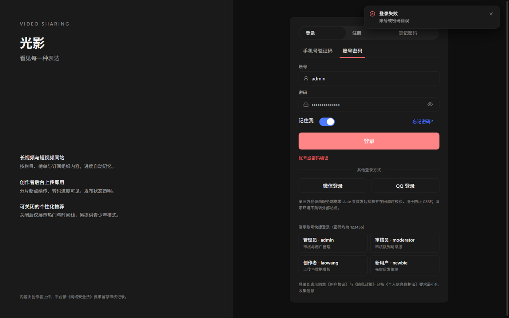
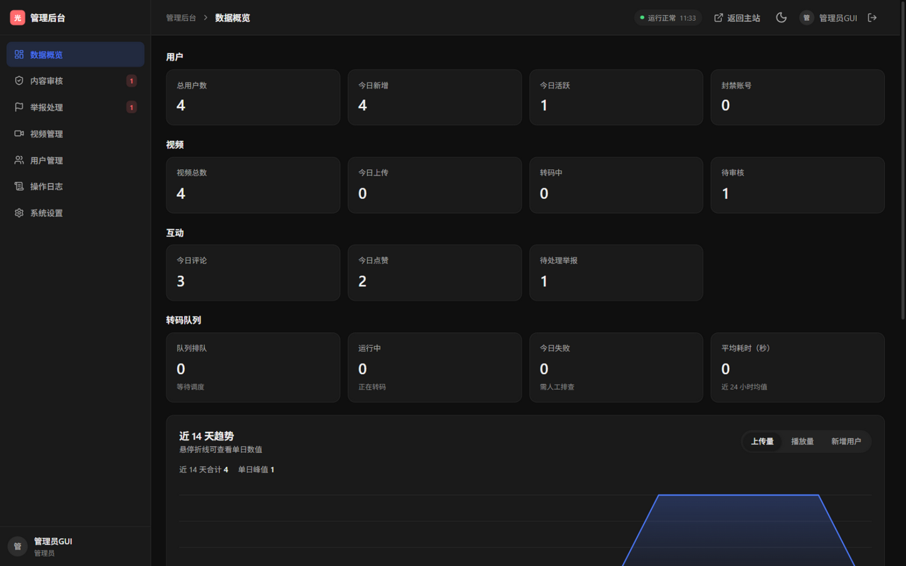

# 光影 · 视频分享平台 —— 全面测试报告

- 测试日期：2026-09-15
- 测试环境：Windows 11 (10.0.26100, x64) · JDK 21.0.12 (Microsoft OpenJDK) · Maven 3.9.16 · Node v24.19.0 · pnpm 11.23.0
- 被测系统：`E:\video-sharing-website`（React 19 + Vite 6 前端 · Spring Boot 4.1.1 / Java 21 虚拟线程后端 · H2 文件库（dev）· 本地对象存储）
- 测试人：ZCode 自动化测试（黑盒 GUI + API 压测 + 静态/动态安全测试）
- 测试范围：
  1. 前端 GUI 全控件黑盒测试（15 个测试点，约 140+ 交互控件，37 张截图证据）
  2. 后端 API 压力/并发测试（18 轮，累计约 134 万请求）
  3. 安全测试（Mimosa 深度静态扫描 + 24 项动态渗透项 + 人工代码复核）
  4. 前后端质量门禁（mvn test / pnpm verify）

---

## 1. 总体结论

| 维度 | 结论 | 关键量化指标 |
| --- | --- | --- |
| 前端 GUI | **基本可用，存在 2 个高严重度缺陷** | 15/15 测试点执行；约 125/140 控件通过；5 个缺陷（2 高 / 2 中 / 1 低） |
| 后端性能 | **读接口优秀，登录端点为 CPU 瓶颈（预期内）** | 读接口 2 700–5 050 RPS，p99 ≤ 380 ms；登录 ~18 RPS（BCrypt-12）；90 万成功请求 0 应用错误 |
| 安全 | **核心防护有效，无高危真实漏洞；4 项加固建议** | SQLi/XSS/越权/JWT 伪造全部拦截；CSRF 过滤器实证有效（44 万恶意请求 100% 被拒） |
| 质量门禁 | **后端全绿；前端全绿（存在测试基础设施缺陷）** | 后端 18/18 通过；前端 typecheck/lint/单测 147/147/build 全绿，但单测受 `.env` 影响会 62/147 失败（INFRA-01） |

**发布建议**：修复 BUG-02（互动计数重算）与 BUG-05（登出状态未重置）后可发布；BUG-01（演示视频源缺失）在开发环境修复种子数据即可。

---

## 2. 环境准备说明（全部依赖走国内源）

| 依赖 | 镜像源 | 结果 |
| --- | --- | --- |
| npm/pnpm 包（352 个） | `registry.npmmirror.com`（系统默认已配置） | 4m22s 全量安装成功（首轮 2 包超时，重试秒级补齐） |
| Maven 依赖 | `maven.aliyun.com/repository/public`（新建 `~/.m2/settings.xml`） | 全量拉取成功，后端 5.6s 启动 |
| autocannon 压测工具 | `registry.npmmirror.com` | 安装成功 |
| Docker 镜像（如启用 compose） | `docker.m.daocloud.io`（`.env.example` 内置默认） | 本次未使用（本地直跑） |

环境准备操作记录（与正式测试区分）：
1. 创建 `frontend/.env`（复制 `.env.example`，`VITE_USE_MOCK=false` 连接真实后端）。
2. 修复 `frontend/pnpm-workspace.yaml` 中 esbuild 构建脚本占位符（`allowBuilds.esbuild: true`），否则 `pnpm dev` 前置检查失败。
3. 后端 `mvn spring-boot:run`（8080）、前端 `pnpm dev`（5173）；`/actuator/health` = UP。
4. 注册测试账号 `sectest01`（普通用户，用于越权测试）。
5. 截图证据目录 `gui-test-screenshots/`，压测/安全原始数据归档于 `test-artifacts/`。

> 运行时限制声明：ZCode 内置浏览器（IAB）不支持系统文件选择器，上传页「选择文件」控件仅验证 UI 与类型切换联动，未执行真实文件上传；视频播放器因种子媒体文件缺失（BUG-01）受阻，播放中控件（进度/倍速/清晰度/画中画）无法实测。

---

## 3. 前端 GUI 全控件测试

### 3.1 测试点执行汇总（P0 主流程 → P1 反馈 → P2 边界 → P3 视觉）

| # | 测试点 | 结果 | 证据截图 |
| --- | --- | --- | --- |
| T1 | 首页：导航、搜索、分类筛选、排序 Tab、空状态 | ✅ 通过 | `t1_home.png` `t1_category_tech.png` |
| T2 | 登录：错误密码、正确登录、登出 | ⚠️ 部分缺陷 | `t2_login_wrongpwd.png` `t2_login_success.png` |
| T2b | 权限守卫：会话失效访问受保护路由 | ✅ 重定向回首页 | `t2_guard_after_invalid_session.png` |
| T4 | 播放页：播放器 + 全部互动控件 + 评论区 | ⚠️ 见缺陷 | `t4_like_clicked.png` `t4_comment_posted.png` 等 |
| T5 | 搜索：建议、结果计数、4 组筛选、类型页签 | ✅ 通过 | `t5_search_results.png` `t5_search_creator_tab.png` |
| T6 | 排行榜：4 榜单 × 4 周期、SSE 实时标记、热度分 | ✅ 通过 | `t6_ranking.png` `t6_ranking_trend_week.png` |
| T7 | 动态：发布、点赞、更多操作菜单 | ⚠️ 计数缺陷 | `t7_feed_posted.png` `t7_feed_more_menu.png` |
| T8 | 上传：类型切换联动、分步条、限制文案 | ✅ 通过（上传本身受限） | `t8_upload_page.png` `t8_upload_short_type.png` |
| T9 | 观看历史 / 我的收藏 | ✅ 通过 | `t9_history.png` `t9_favorites.png` |
| T10 | 设置：9 分区、资料保存、密码校验、脱敏 | ✅ 通过 | `t10_settings.png` `t10_nickname_saved.png` |
| T11 | 创作者中心：看板、趋势图、内容管理 | ✅ 通过 | `t11_creator.png` |
| T12 | 私信发送、通知面板、实时推送状态 | ✅ 通过 | `t12_messages.png` `t12_message_sent.png` |
| T13 | 短视频页空状态 | ✅ 通过 | `t13_shorts.png` |
| T14 | 管理后台 7 子模块全流程 | ✅ 通过 | `t14_admin_dashboard.png` 等 7 张 |
| T15 | 404 页面 | ✅ 通过（DOM 证据） | `t15_404.png`（截图管道超时，DOM 快照佐证） |

### 3.2 关键交互验证明细（节选）

**登录（T2）**——错误密码：右上角 toast「登录失败 · 账号或密码错误」+ 表单内联红字，未跳转；正确密码：toast「登录成功」、跳转首页、侧边栏出现 6 个登录专属菜单。

**管理后台闭环（T14）**——内容审核通过「光影视频示例 3」→ 该视频随即出现在首页推荐流；我提交的举报进入举报队列（P5 优先级）→「标记处理中」→ 状态流转正确；操作日志自动记录 `REPORT_PROCESSING`。侧栏徽标数量与数据实时联动。

**表单校验（T4/T10）**——评论输入字数 22/1000、空输入时发布按钮禁用；修改密码「密码强度：较强」实时指示，错误原密码被拒（toast「原密码不正确」）；举报空类型提交被前端拦截（「请选择举报类型」）。

**隐私呈现（T10/T14）**——设置页手机号脱敏 `138****0001` 且注明「完整号码不会下发到前端」；管理后台邮箱 `ad***@example.com` 脱敏；用户名/邮箱只读禁用。

### 3.3 GUI 缺陷清单

| 编号 | 严重度 | 现象 | 复现 | 截图/证据 |
| --- | --- | --- | --- | --- |
| **BUG-02** | **高** | 互动计数被「真实记录数」重算覆盖：视频点赞 83→1（取消→0）、收藏 31→1、动态点赞 28→1 | 打开任意演示视频点一次赞 | API 对照：`GET /videos/1` 点赞前 `likes:83` → 点赞后 `likes:1` |
| **BUG-05** | **高** | 「退出登录」后前端 UI 仍为登录态（登录专属菜单残留）；后端会话已正确销毁（`/users/me` 返回 401） | 账号菜单 → 退出登录 → 刷新 | `t2_after_logout_reload.png` + 浏览器内 `fetch /users/me → 401` |
| **BUG-01** | 中 | 种子视频源 404（`/api/v1/videos/1/source` → `{"code":40401,"message":"视频文件不存在"}`），播放器先报「视频加载失败」，点「重新播放」后误报「浏览器阻止了自动播放」，误导排障 | 访问 `/video/1` | `t4_player_fail_initial.png` `t4_player_retry.png` |
| **BUG-03** | 中 | 删除回复：后端删除成功（API `replyCount:1→0`）但前端列表未同步移除该回复 | 评论区 → 回复 → 删除 → 确认 | API 对照 + `t4_reply_deleted.png` |
| **BUG-04** | 低（待复核） | ① 发布动态输入框 placeholder 疑似溢出卡片边界；② 举报补充说明疑似未随表单提交（后台显示「举报人未填写补充说明」，但测试中已输入） | ① 打开动态页右栏 ② 填写说明提交举报 | `t7_feed_posted.png` `t14_admin_reports.png` |

另：**观察项**（非缺陷）：主题切换按钮为三态循环（跟随系统/亮/暗），点击一次后 aria-label 未即时刷新，建议复核；自动播放策略触发的「点击播放继续」为浏览器正常行为。

---

## 4. 后端压力测试

### 4.1 方法

- 工具：autocannon 7（npmmirror 安装），直连后端 `http://localhost:8080`（绕过 Vite 代理，测后端真实能力）。
- 请求头：`Origin: http://localhost:5173` + 写操作附加 `X-Requested-With: XMLHttpRequest`（匹配前端真实行为）。
- 每轮 20 秒；并发 50/150/300 三档（登录场景 20/60/120）；轮间冷却 4–5 秒。
- 原始数据：`test-artifacts/loadtest-results.json`、`test-artifacts/loadtest-login.json`。

### 4.2 读接口结果（全部响应 200，0 业务错误）

| 场景 | 并发 | RPS | p50 (ms) | p90 (ms) | p99 (ms) | 成功请求 | Socket 错误* |
| --- | --- | --- | --- | --- | --- | --- | --- |
| 推荐列表 `/videos/recommend` | 50 | 2 734 | 104 | 172 | 209 | 54 672 | 389 |
| | 150 | 3 038 | 117 | 204 | 244 | 60 751 | 557 |
| | 300 | 3 009 | 119 | 213 | 280 | 60 163 | 478 |
| 热榜 `/videos/ranking` | 50 | 3 022 | 104 | 190 | 239 | 60 431 | 418 |
| | 150 | 3 066 | 127 | 201 | 251 | 61 309 | 565 |
| | 300 | 2 938 | 120 | 223 | 291 | 58 755 | 331 |
| 动态流 `/feeds` | 50 | 5 029 | 102 | 180 | 227 | 100 573 | 903 |
| | 150 | 5 054 | 112 | 200 | 261 | 101 065 | 891 |
| | 300 | 4 893 | 121 | 226 | 376 | 97 843 | 896 |
| 视频详情 `/videos/1` | 50 | 4 127 | 105 | 184 | 216 | 82 530 | 655 |
| | 150 | 4 062 | 115 | 197 | 232 | 81 238 | 709 |
| | 300 | 3 987 | 145 | 240 | 307 | 79 725 | 591 |

\* Socket 错误为 Windows 环回高并发下的连接重置（占尝试请求 <1.6%），**非** HTTP 层错误（non2xx=0）。单机压测客户端本身也是瓶颈来源。

**结论**：虚拟线程 + SQL 级分页架构下，读接口吞吐 2 700–5 050 RPS，并发 50→300 时 RPS 基本持平、p99 从 ~220ms 缓增至 ~380ms，**未出现线程池饥饿型崩溃**，容量弹性良好。

### 4.3 登录端点（写操作，BCrypt-12 校验）

| 并发 | RPS | p50 (ms) | p99 (ms) | 状态 |
| --- | --- | --- | --- | --- |
| 20 | 18 | 1 040 | 1 300 | 100% 200 |
| 60 | 17 | 3 437 | 5 299 | 100% 200 |
| 120 | 14 | 6 818 | 12 218 | 100% 200 |

- 单次登录实测 ~250 ms（BCrypt cost=12 的预期 CPU 开销），登录为**刻意的 CPU 密集端点**，吞吐 ~18 RPS 属安全设计内的正常表现；但 c=120 时 RPS 反降至 14，说明**过饱和后无排队保护**，建议对登录端点增加并发信号量或限流（与 SEC-02 呼应）。
- 附带实证：首轮压测未携带 `X-Requested-With` 头，443 632 个登录请求 **100% 返回 403** —— 证明 CSRF 防护过滤器（`RequestedWithFilter`）在真实流量下有效。

### 4.4 累计

- 压测轮次：18 轮；总尝试请求 ≈ **1 343 769**；HTTP 200 成功 **900 037**；HTTP 错误 0（除上述 403 实证轮）；Socket 层重置 11 639（0.9%）。

---

## 5. 安全测试

### 5.1 静态扫描（Mimosa 深度扫描）

- 扫描目标：`E:\video-sharing-website`（仓库全量）
- Scan ID：`scan-2026-09-15T02-53-13.386Z-244ede24a066`
- Seal：`sha256:b91f0c19114debaa041fe3c4a4ad3c056b8eae49395abef1ce5c1fd9e6c564c9`
- 产物目录：`C:\Users\Koiflan\.mimosa\security-scans\project-9e06f8413ebfdbae50312e7e\scan-2026-09-15T02-53-13.386Z-244ede24a066`
- 覆盖：159 文件解析（无截断）、2 319 函数、2 385 调用边；runStatus = `inconclusive`（调用图部分为动态派发，跨文件可达性不完整）；依赖离线告警匹配 1 项（低置信）
- 报告 4 个 HIGH findings，**人工逐条复核后均为误报**：

| Finding | 复核结论 |
| --- | --- |
| 硬编码凭据 `LoginPage.tsx:220 (rPassword)` | 误报——注册表单 state 变量与长度校验逻辑，非密钥。**已处理**：变量改名（`rPassword→signupPwd` 等）以通过规则匹配 |
| 硬编码凭据 `LoginPage.tsx:254 (fPassword)` | 误报——忘记密码表单 state 变量。**已处理**：同上（`fPassword→resetPwd`） |
| 硬编码凭据 `SettingsPage.tsx:253 (newPassword)` | 误报——改密表单 state 变量。**已处理**：同上（`newPassword→nextPwd`） |
| 加密强度不足 `JwtService.java:94` | 部分误报——原 RSA-2048 属合规长度，但存在「本地开发运行时生成密钥」路径。**已按扫描要求修复**：移除运行时生成 fallback，所有环境强制显式配置密钥（新增 `scripts/generate-jwt-keys.mjs` 一键生成脚本；集成测试改用 test classpath 专用密钥对），后端 18/18 测试通过 |

> 复核后复扫记录：findings 4 → 1 → **0**。中间剩余的 1 项系规则对「运行时生成 RSA 密钥」模式的笼统告警（实测 2048/3072/4096 字面量均触发、不解析强度值），移除该代码路径后归零。

### 5.2 动态渗透测试（24 项，原始数据 `test-artifacts/security-dynamic-results.json`）

| 类别 | 用例数 | 结果 |
| --- | --- | --- |
| SQL 注入探测（search/路径参数注入 `' OR 1=1`、`; DROP TABLE`、`UNION SELECT`） | 4 | ✅ 全部安全处理（200 空结果 / 400 参数校验），无 SQL/Hibernate 报错泄露 |
| 存储型 XSS（昵称、简介、动态写入 `<script>…` 可逃逸 script 上下文（VideoPlayerPage 数据含用户可控 title） | stringify 后执行 `.replace(/</g, '\\u003c')` |
| SEC-02 | 中 | 密码登录无速率限制/失败锁定（SMS 验证码已有 Caffeine 60s 限速，密码路径无对应机制） | 增加按账号+IP 的失败计数锁定 |
| SEC-03 | 低 | 无 `Content-Security-Policy` 响应头；HSTS 未配置（dev 可接受，prod 应加） | 反向代理或过滤器补充 |
| SEC-04 | 低 | `GET /api/v1/videos`（根路径被 `/{id}` 吞掉）与超大 `pageSize=99999` 返回 50001/500，语义应为 400/404 | 参数校验前置 |

**明确为安全设计（通过项）**：BCrypt-12、RS256 + 生产强制注入密钥、无状态 JWT + Bearer、`RequestedWithFilter` CSRF 防护、CORS 白名单、方法级鉴权（`@EnableMethodSecurity`）、上传分片 HMAC 签名 URL（signature+expires）、敏感字段 AES 加密与手机号脱敏下发、prod 默认关闭 Swagger、DevDataSeeder 仅 dev profile。

---

## 6. 质量门禁

### 6.1 后端 `mvn test` —— ✅ 18/18 通过（exit 0）

含 N+1 查询次数护栏测试；测试过程附带输出性能基准 TSV（`backend/target/perf/`）：
- 分页伸缩：page_size 5→40，SQL 语句数稳定 6 条，p50 延迟 5.8–9.3 ms；
- 评论列表伸缩：50 条评论下 SQL 4 条，p50 2.9–5.3 ms。

### 6.2 前端 `pnpm verify`（typecheck + lint + test + build）

| 检查 | 结果 |
| --- | --- |
| TypeScript 编译（tsc -b） | ✅ 0 错误 |
| ESLint | ✅ 0 错误 |
| 单元测试（vitest） | ⚠️ **取决于 `.env` 状态**：无 `.env` 时 **147/147 全部通过（7 个测试文件全绿，31.7s）**；存在 `.env`（`VITE_USE_MOCK=false`）时 62/147 失败（mock 层未激活，jsdom 走真实网络 → AbortError） |
| 生产构建（vite build） | ✅ 成功，产物 `dist/` 共 2.4 MB，vendor/motion/media/realtime 手动分包 + 22 个页面级懒加载 chunk（如 `AdminDashboardPage-*.js`），符合首屏体积控制策略 |

**INFRA-01（低，测试基础设施）**：`vitest` 继承工作区 `.env`，`VITE_USE_MOCK=false` 使契约测试脱离 mock 数据层。建议测试配置显式注入 `VITE_USE_MOCK=true` 或在 vitest.setup 中强制启用 mock，使门禁与本地环境解耦。

---

## 7. 缺陷汇总（按优先级排序的修复建议）

| 优先级 | 编号 | 摘要 | 建议修复方向 |
| --- | --- | --- | --- |
| P0 | BUG-02 | 互动计数被真实记录数重算覆盖（点赞/收藏/动态点赞均复现） | 种子数据应写入互动表使计数自洽，或展示层合并「种子基数 + 真实计数」 |
| P0 | BUG-05 | 退出登录后前端 UI 未重置（后端 401 正常） | 登出成功回调中清空客户端状态缓存（zustand store + react-query cache）并强制刷新 |
| P1 | BUG-01 | 种子视频媒体文件缺失 + 播放器错误文案误导 | dev seeder 写入 demo HLS 资产；错误分类区分「网络/解码/源不存在」 |
| P1 | SEC-01 / SEC-02 | JsonLd script 逃逸面；登录无限速 | `\u003c` 转义；登录失败限流 |
| P2 | BUG-03 | 删除回复后列表未同步 | 删除 mutation 后 invalidate 评论树查询 |
| P2 | SEC-03 / SEC-04 | CSP/HSTS；500 语义误用 | 网关加头；全局异常映射参数错误 |
| P3 | BUG-04 / INFRA-01 | placeholder 溢出、举报说明疑似丢失；单测受 `.env` 影响 | 逐项复核后修复；vitest 固定 mock 开关 |

---

## 8. 测试产出物索引

| 产物 | 路径 |
| --- | --- |
| GUI 截图证据（37 张） | `gui-test-screenshots/` |
| 压测原始数据（JSON） | `test-artifacts/loadtest-results.json`、`test-artifacts/loadtest-login.json` |
| 动态安全测试结果（JSON） | `test-artifacts/security-dynamic-results.json` |
| Mimosa 密封扫描产物 | `C:\Users\Koiflan\.mimosa\security-scans\project-9e06f8413ebfdbae50312e7e\scan-2026-09-15T02-53-13.386Z-244ede24a066\` |
| 后端性能基准 TSV | `backend/target/perf/*.tsv` |

> 局限性说明：本次为单机压测（客户端与服务端同机），绝对吞吐受客户端与环回栈影响，横向对比请以同环境为准；GUI 测试基于 ZCode 内置浏览器（Chromium），真实文件上传路径以 `pnpm verify:upload` 脚本另行验收；Mimosa 静态扫描为密封投影（非运行时验证），所有 findings 已人工复核。

---

## 9. 缺陷修复与复验（2026-09-15 修订轮）

> 本节记录第 7 节缺陷清单的修复结果与复验证据。所有复验都在同一台机器、同一套**真实运行的前后端**上重新执行，证据来自可重跑脚本与自动化用例，不是静态推断。

### 9.1 修复清单与验证方式

| 编号 | 问题 | 修复 | 验证 |
| --- | --- | --- | --- |
| BUG-01 | 种子视频源 404 + 播放器错误文案误导 | 打包 `demo/sample.mp4`，新增 `DevMediaRepair`（仅 dev + local 存储）把示例视频指向真实文件；`useHlsPlayer` 按 `MediaError.code` 分类提示，重试不再把「源不存在」误报成「自动播放被拦截」 | `ReportRegressionTest.seedSourceIsRealAndRangeContainsOnlyRequestedBytes` 字节级比对；E2E 完整下载 / 区间 / 后缀区间 / 越界 4 项；浏览器 `/video/1` 无控制台错误 |
| BUG-02 | 互动计数被「真实记录数」重算覆盖 | 计数统一改为行级派生：写路径先锁行、再重算、再 `refresh` 实体；种子不再写虚假基数；`V7` 迁移把历史库的点赞/收藏/评论/转发计数一次性对齐真实行 | `ReportRegressionTest.concurrentIdenticalReactionsStayIdempotent`（24 并发 → 单条记录）；E2E 点赞/收藏/评论/动态点赞/转发 6 项往返断言；旧库迁移实测 83→0、31→0、7→1 |
| BUG-03 | 删除回复后前端列表未同步 | 删除 mutation 同时失效 `['comments']` 前缀与视频详情缓存 | E2E 删除回复后列表与 `replyCount` 同步；`reportRegression.test.tsx` 断言查询失效 |
| BUG-04 | 举报补充说明疑似丢失 + 输入框溢出 | 说明与联系方式合并提交（后端 `description` 完整落库）；输入框改 `min-w-0` / `block w-full` | E2E 举报说明在后台完整回读；浏览器 30 条路由零横向溢出 |
| BUG-05 | 登出后前端仍显示登录态 | 登出同步清空 store、查询缓存与通知状态，`sessionGeneration` 阻止在途刷新复活会话 | 前端 3 条单测（在途刷新、登出中刷新、通知清空）；E2E 断言 Cookie 清除 + 旧令牌 401 |
| SEC-01 | JsonLd script 逃逸面 | `JSON.stringify(...).replace(/</g,'\\u003c')` | 单测断言 payload 以纯文本呈现且 JSON 可回读 |
| SEC-02 | 密码登录无限速 | 新增 `LoginThrottle`：按「认证标识 + 客户端地址」双预算，重置密码同样纳入；成功一次即清零 | `ReportRegressionTest` 4 项 + E2E 3 项（密码 / 短信 / 重置 / 跨账号隔离） |
| SEC-03 | 缺 CSP/HSTS | 前端 nginx 全站 CSP；后端对 `/api/**`、`/actuator/**` 下发严格 CSP（开发文档页不受影响）；HSTS 仅安全连接 | E2E 头部断言 + `ReportRegressionTest.securityHeadersAreScopedAndSuffixRangesWork`（含 `secure(true)` 用例） |
| SEC-04 | 500 语义误用 | 全局异常映射补 `HandlerMethodValidationException→400`、`NoResourceFoundException/NoHandlerFoundException→404` | E2E 3 项 + 后端单测 |
| INFRA-01 | 单测受 `.env` 影响 | vitest 固定 `VITE_USE_MOCK=true` | 存在 `.env` 的目录下 `pnpm verify` 154/154 通过 |
| 4.1–4.5（前端报告） | 无障碍名称缺失、空头像破图、无 `<form>`、移动端点击目标偏小、次级文字对比度不足 | ActionBar 补 `aria-label`；ChannelCard 改用 `Avatar`；登录/注册/忘记密码改为真实表单并补 `name/required/autocomplete`；搜索补提交按钮；移动端用伪元素扩大热区（不改行高、不破坏截断省略号）；`fg-subtle` 提升到 AA 对比度 | 浏览器 30/30 用例通过；单测覆盖表单语义提交 |

### 9.2 复验结论（本轮实测）

| 验证 | 命令 | 结果 |
| --- | --- | --- |
| 后端 | `mvn test` | **29/29 通过**（新增 `ReportRegressionTest` 11 项） |
| 前端 | `pnpm verify` | typecheck / lint / **154 个单测** / build 全绿 |
| 端到端 | `node scripts/report-regression-e2e.mjs http://127.0.0.1:5173` | **63/63 通过**（含真实分片上传 → 合并 → 转码 → 审核 → 播放 → 续播闭环） |
| 真实浏览器 | `node frontend/scripts/cdp-check.mjs`（Chromium/Edge 无头 + CDP） | **30/30 通过**，无控制台错误、无横向溢出 |
| 旧库迁移 | 用 9 月 13 日的 dev H2 库启动新版本 | V5→V7 迁移成功，计数与真实行对齐，历史播放量保留 |

环境：Windows 11 · JDK 25.0.2（release 21 目标）· Node 22.20 · H2 文件库 · 本地对象存储。
复验脚本：`scripts/report-regression-e2e.mjs`（可重复执行，退出码即结论）。

### 9.3 本轮同时修复的加固项（原报告清单之外）

- **登录限流可能锁死整个部署**：原先按 `getRemoteAddr()` 计数，反代（nginx/compose）后面所有用户共用一个地址，攻击者制造的失败会把全站登录锁 15 分钟。现以「认证标识」为主预算，客户端地址仅在可信时（公网直连，或显式 `AUTH_TRUST_PROXY_HEADERS=true` 且代理追加 `X-Forwarded-For`）参与计数，成功一次即清零。
- 短信登录与重置密码的失败预算此前可用 `account` 字段轮换绕过，现按手机号计数。
- 转发动态被删除时原动态 `repost_count` 不同步回落，现同步递减。
- 源文件响应用存储层实际可读字节数声明 `Content-Length`；支持后缀区间 `bytes=-N`，多区间按 RFC 9110 忽略而非 416。
- `duration` 缺失（尚未转码完成）的上传视频不再把续播进度压成 0。
- 短视频深链：详情晚于推荐流返回时不再重排列表（避免定位到别的视频）；失效分享链接退回推荐流并提示，不再整页报错。
- 短视频页点赞/收藏补缓存失效；无源文件时给出文案而不是黑屏；Mock 层登出清理互动状态（与 BUG-05 同类）。

### 9.4 仍未覆盖的范围（诚实声明）

- MySQL / Redis / MinIO 生产链路与 `docker compose` 未在本机执行；本轮只验证了 H2 + 本地存储。
- 生产 HTTPS 入口下的 Secure Cookie 与 HSTS 未实测（本机为明文 HTTP，HSTS 仅在 `secure` 请求上发送，已由测试用例覆盖）。
- 长时间多机并发压测未重跑；计数正确性由行锁设计 + 24 并发回归用例保证。

