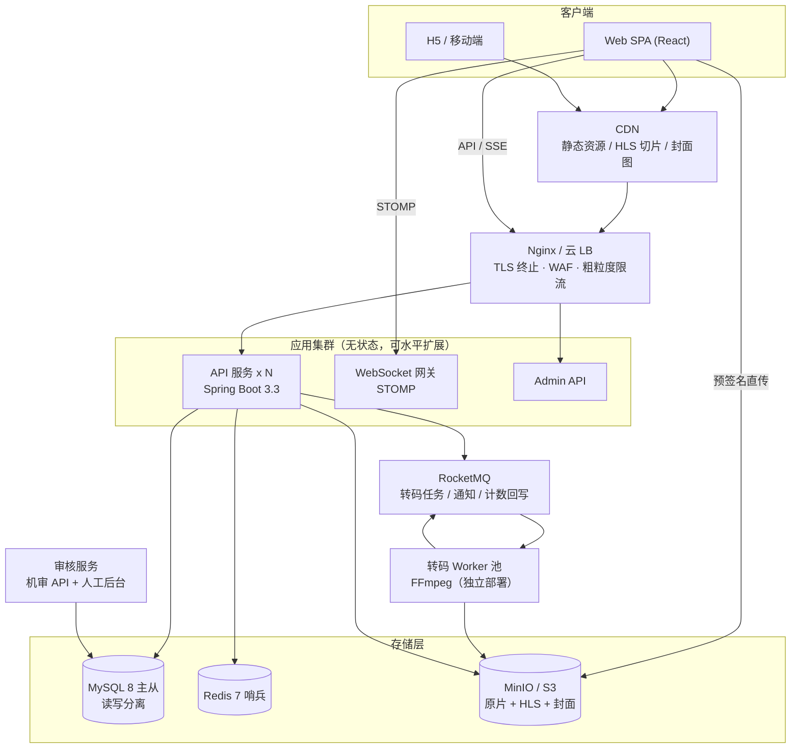
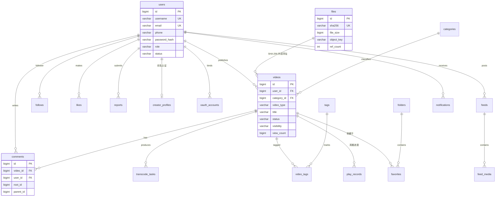
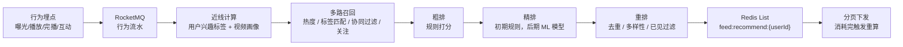
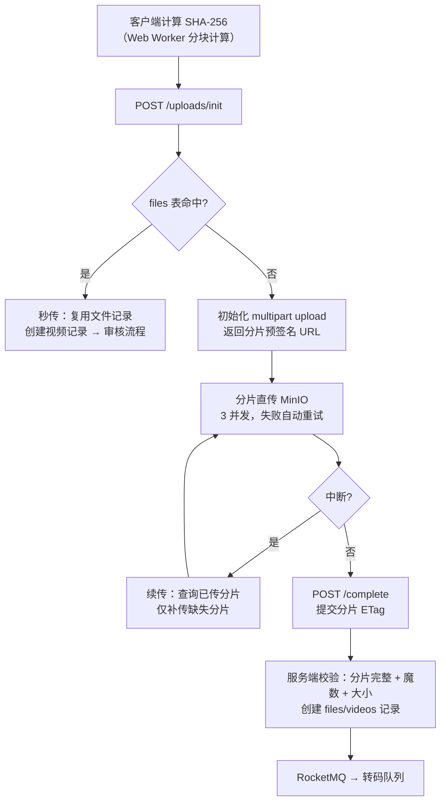
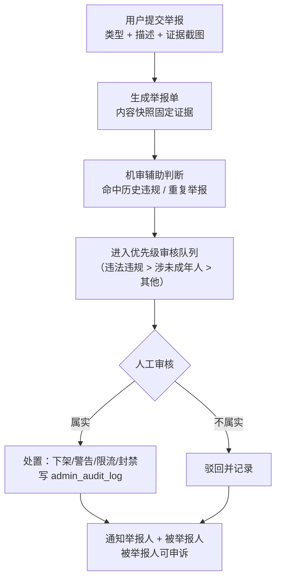
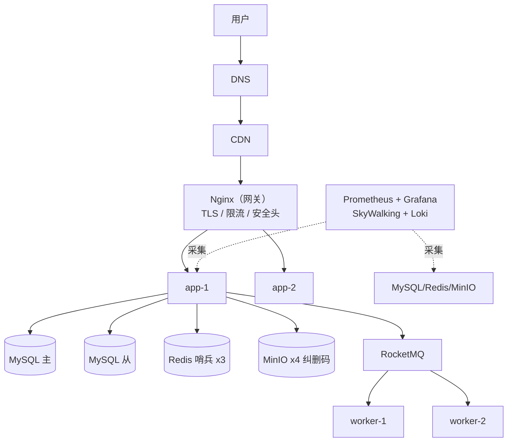

视频分享网站 · 项目开发文档
文档版本：v2.0 | 状态：评审稿 | 编制日期：2026-09-13

假设说明：本文档基于以下假设，如有偏差请团队评审时修正——① 项目初期以单体分层架构为主，预留微服务拆分能力；② 对象存储选用 MinIO（可替换为 S3/OSS），消息队列选用 RocketMQ 5.x；③ 推荐算法初期采用规则+热度策略，后续引入 ML 排序模型；④ 弹幕和投币功能标记为可选（P2 优先级）；⑤ 平台默认面向中国大陆运营，合规要求见第 14 章，若仅面向海外则跳过该章大部分内容。

修订记录（v1.0 → v2.0）

类别	变更摘要
安全	① Token 存储从 localStorage 改为「Access Token 内存 + Refresh Token httpOnly Cookie」，Refresh Token 旋转 + 复用检测（RFC 9700）；② 修复秒传设计缺陷：MD5 全库唯一索引会导致不同用户共享同一条视频记录（可越权访问他人私密视频），改为 SHA-256 内容寻址 files 表 + 引用计数；③ 上传链路补齐文件魔数校验、格式白名单、大小/时长上限；④ 短信验证码补防轰炸与防爆破设计；⑤ 补 CSRF/XSS/CORS/CSP/越权(IDOR)防护与播放量防刷；⑥ 补密钥管理、依赖扫描、容器非 root 运行。
合规	新增第 14 章「合规与法律」：ICP 备案/公安备案、经营性 ICP、信息网络传播视听节目许可证风险、算法备案、青少年模式、实名制、个人信息保护（账号注销）、版权投诉通道。ICP 备案等长周期事项提前至 M1 启动。
数据模型	videos 表新增 video_type（长/短视频）、category_id 外键、REVIEWING 状态（修复「转码完成直接发布」与「先审后发」的矛盾）；计数列 INT → BIGINT；新增 files、creator_profiles、subscriptions、playlists 等缺失表。
架构	补齐 5 处空白图（总体架构/ER/推荐流程/举报流程/部署架构）；消息队列选型落定 RocketMQ；上传改为 MinIO 预签名分片直传（应用不再中转文件流）；统一实时通信方案（互动通知用 STOMP over WebSocket，榜单用 SSE）。
转码	FFmpeg 命令修正：禁止低清源放大（scale=w=-2:h=H + 动态裁剪阶梯）、GOP 与分片时长对齐（-g 60 -sc_threshold 0）、VBV 码率控制、TS 改 fMP4(CMAF)；补充转码失败重试与中间产物清理。
指标	统一全文性能指标（v1.0 中 FCP/P95 三处数值互相矛盾）；热度公式改为对数归一化（避免播放量主导排序）。
流程	补充播放计数规则（≥3s + 24h 去重）、评论频率/长度限制、软删除与 30 天回收站、备份容灾、测试策略、CI/CD 与灰度回滚。

目录
1. 项目概述与目标
2. 用户角色与权限
3. 功能需求清单（含优先级）
4. 页面与布局设计
5. 前端技术方案
6. 后端架构
7. 数据库设计
8. Redis 缓存设计
9. 实时推荐与排行榜设计
10. 上传、转码、下载流程
11. 互动系统设计
12. UI/UX 与去 AI 味设计规范
13. 安全、审核、风控
14. 合规与法律（新增）
15. 性能、可用性、扩展性
16. 部署与运维
17. 开发计划与里程碑
18. 测试策略（新增）
19. 验收标准
20. 风险与取舍

1. 项目概述与目标
1.1 产品定位
构建一个支持长视频、短视频和微博式动态信息流的综合视频分享平台。参考 YouTube/BiliBili 的长视频体验、TikTok 的沉浸式短视频消费，以及微博的社交信息流，形成「观看—互动—创作—社交」闭环。

1.2 核心目标
维度	目标
用户体验	首屏 FCP ≤ 1.5s，视频首帧 ≤ 2s（弱网 ≤ 4s），短视频滑动切换 ≥ 55fps
内容生态	支持 UGC/PUGC 创作，覆盖 10+ 分区，日均上传 ≥ 1000 条
社交互动	关注/粉丝关系链，评论/弹幕实时互动，消息通知秒级触达
推荐能力	个性化推荐 CTR ≥ 8%，热门榜 10 分钟内更新、趋势榜 5 分钟内更新
可扩展性	单体分层起步，支持水平扩展至百万 DAU，视频存储无限扩容
安全合规	上线前完成 ICP/公安备案，通过 OWASP Top 10 安全验收，全链路内容审核可用

2. 用户角色与权限
2.1 角色模型
角色采用「主角色 + 创作者认证」双层模型：users.role 存权限主角色（USER/MODERATOR/ADMIN），创作者身份由 creator_profiles 表（实名认证状态）表达。任何角色都保留普通用户的浏览与上传能力——审核员本身也是用户，同样可以上传视频。管理员不与 USER 互斥，通过权限点（permission）集合做最终权限判定，避免 v1.0 中单 role 列无法表达身份叠加的问题。

2.2 角色说明
角色	说明	核心权限
游客	未登录用户	浏览首页、播放视频、搜索、查看排行榜
普通用户	已注册用户	游客权限 + 点赞/收藏/评论/关注/私信/上传视频/发动态
创作者	通过实名认证的普通用户	普通用户权限 + 数据看板/内容管理/下载授权/收益中心
审核员	平台内容审核人员	审核队列/举报处理/内容下架/用户警告（同时保留普通用户全部权限）
管理员	平台管理员	全部权限 + 用户管理/角色分配/系统配置/数据分析

2.3 权限矩阵
操作	游客	普通用户	创作者	审核员	管理员
浏览/播放	✅	✅	✅	✅	✅
点赞/收藏/评论	❌	✅	✅	✅	✅
上传视频	❌	✅	✅	✅	✅
开启下载	❌	❌	✅	❌	✅
审核内容	❌	❌	❌	✅	✅
用户管理/角色分配	❌	❌	❌	❌	✅
实现要求：所有写接口在 Service 层校验资源属主（防止 IDOR 越权，如水平越权编辑/删除他人视频），不信任前端传入的 userId。

3. 功能需求清单（含优先级）
3.1 用户系统
功能	优先级	说明
注册/登录	P0	手机号+验证码（主）、邮箱+密码、OAuth 第三方（微信/QQ，State 参数防 CSRF）
JWT 鉴权	P0	Access Token（15min，内存持有）+ Refresh Token（7d，httpOnly Cookie，旋转+复用检测），见 13.1
实名认证	P1	创作者实名认证（对接持牌服务商），合规前置条件
个人主页	P0	头像/简介/作品/动态/收藏/关注列表
关注/粉丝	P0	关注/取关、粉丝列表、互关标识
订阅	P1	订阅分区/UP主，新内容推送
通知	P1	系统通知/互动通知/订阅更新，实时推送
私信	P2	文字/图片/视频分享
账号注销	P1	7 天冷静期后匿名化处理（合规要求，见 14.5）

3.2 视频功能
功能	优先级	说明
分片上传	P0	8MB/片（可配），MinIO 预签名直传，3 并发
断点续传	P0	服务端记录已上传分片，客户端续传
秒传	P1	SHA-256 全文件校验，命中且源视频可见则复用文件，新视频记录仍走审核
FFmpeg 转码	P0	360P/480P/720P/1080P 自适应阶梯（不放大），HLS fMP4 切片
封面截取	P0	转码时自动截取首帧/指定时间帧，生成 WebP 缩略图
播放器	P0	清晰度切换/倍速/画中画/全屏/记忆播放
短视频沉浸播放	P0	全屏垂直滑动，自动播放/暂停
下载	P1	创作者可开启，清晰度选择，时效签名防盗链
收藏/稍后观看/历史	P0	个人内容管理
播放列表	P1	用户自建播放列表
字幕	P2	上传 SRT/VTT，播放器挂载

3.3 互动功能
功能	优先级	说明
点赞/点踩	P0	乐观更新，Redis 计数器
评论/楼中楼	P0	二级嵌套评论，长度 ≤ 1000 字，用户级频率限制
分享	P0	站内/微信/微博/复制链接
举报	P0	举报类型+描述，进入审核队列
弹幕	P2	时间轴弹幕，CSS transform 渲染
投币	P2	虚拟币系统

3.4 推荐与排行榜
功能	优先级	说明
首页推荐	P0	召回+排序，支持冷启动
相关视频	P1	基于标签/协同过滤
关注流	P0	关注用户的新内容时间线（读扩散，见 9.3）
短视频推荐	P0	沉浸式推荐流
排行榜	P0	热门/趋势/分类/新人，日/周/月/总榜
实时推送	P1	SSE 推送榜单变化
搜索	P0	初期 MySQL FULLTEXT（ngram 分词）+ 缓存，中期 OpenSearch/ES

3.5 动态页（微博式）
功能	优先级	说明
发布动态	P1	图文/视频/转发/话题/@
信息流	P1	关注流+推荐流
转发/评论/点赞	P1	与视频互动逻辑一致

4. 页面与布局设计
4.1 长视频布局（YouTube/BiliBili 风格）
桌面端布局：

```text
┌─────────────────────────────────────────────────────┐
│  TopNav: Logo | 搜索栏 | 上传 | 通知 | 头像         │
├────────┬────────────────────────────────────────────┤
│        │  ┌──────────────────────────────────────┐  │
│ 左侧   │  │        视频播放器 (16:9)              │  │
│ 菜单   │  └──────────────────────────────────────┘  │
│        │  标题 / 播放量 / 发布时间 / 操作按钮       │
│ · 首页 │  频道信息 / 关注 / 订阅                    │
│ · 热门 │  简介（展开/收起）                         │
│ · 订阅 │  ────────────────────────────────          │
│ · 历史 │  评论区（排序/输入/列表/楼中楼）           │
│ · 收藏 │                                            │
│ · 稍后 │  ┌──────────┐                              │
│        │  │ 侧边推荐  │ ← 桌面端右侧                   │
│        │  │ 视频卡片  │                              │
│        │  └──────────┘                              │
└────────┴────────────────────────────────────────────┘
```
移动端：播放器全宽 → 信息折叠 → 评论 → 推荐瀑布流。左侧菜单收为汉堡抽屉。

4.2 短视频布局（TikTok 风格）
```text
┌──────────────────────┐
│                      │
│    视频全屏区域       │
│    (object-fit:cover) │
│                      │
│            ┌────┐    │
│            │头像 │    │
│            │点赞 │    │  ← 右侧互动栏
│            │评论 │    │
│            │分享 │    │
│            └────┘    │
│                      │
│  @用户  · 描述文字    │  ← 底部信息区
│  🎵 原声 - 音乐名     │
└──────────────────────┘
   ↑ 上滑切换下一个视频
```
全屏垂直滑动切换，单视频占满视口

播放器自动播放/暂停由 IntersectionObserver + 滑动位置控制

双击点赞（粒子动画），长按倍速，右滑进入个人主页

4.3 动态页布局（微博式）
顶部 Tab 切换「推荐/关注/热门」，信息流卡片包含：用户头像+昵称+时间 → 文字内容 → 图片九宫格/视频缩略 → 转发/评论/点赞计数。点击卡片进入详情页。

5. 前端技术方案
5.1 技术栈
层面	选型	版本
框架	React	19.x（团队不熟悉 19 可退 18.3 LTS）
语言	TypeScript	5.x
构建	Vite	6.x
路由	React Router	7.x
服务端状态	TanStack Query	5.x
客户端状态	Zustand	5.x
样式	Tailwind CSS	4.x
动画	Framer Motion	11.x
实时通信	STOMP over WebSocket（@stomp/stompjs）+ SSE	-
播放器	HLS.js 1.5+ + 自研控制层	-

选型理由：TanStack Query 管理服务端状态（缓存/重试/失效/乐观更新），Zustand 管理纯客户端状态（播放器/主题/UI），两者职责清晰不重叠。实时通信统一方案：需要双向通信的场景（通知、转码进度、举报状态）用 STOMP over WebSocket（对接 Spring WebSocket + STOMP）；单向推送场景（榜单变化）用 SSE，成本更低。v1.0 中「原生 WebSocket」与「STOMP 客户端」两处描述不一致，此处统一。

安全说明：Refresh Token 使用 httpOnly Cookie，JS 不可读；Access Token 仅存内存（Zustand store），页面刷新后通过 /auth/refresh 静默换取，杜绝 XSS 窃取长期凭证。localStorage 只允许存放主题、音量、UI 偏好等非敏感数据（见 13.1）。

5.2 路由表
路径	页面	布局	鉴权
/	首页推荐	MainLayout	否
/video/:id	长视频播放页	MainLayout	否
/shorts	短视频沉浸页	ImmersiveLayout	否
/feed	动态信息流	MainLayout	否
/feed/:id	动态详情	MainLayout	否
/user/:id	个人主页	MainLayout	否
/user/:id/videos	用户作品	MainLayout	否
/upload	上传页	MainLayout	是
/search	搜索结果	MainLayout	否
/ranking	排行榜	MainLayout	否
/history	观看历史	MainLayout	是
/favorites	收藏夹	MainLayout	是
/messages	私信	MainLayout	是
/settings	设置	MainLayout	是
/admin/*	管理后台	AdminLayout	是（审核员+）

5.3 组件树（核心页面）
VideoPlayerPage 组件树：

```text
VideoPlayerPage
├── PlayerContainer
│   ├── VideoPlayer (HLS.js)
│   │   ├── PlayerControls (播放/进度/音量/倍速/画中画)
│   │   ├── QualitySelector (360P/480P/720P/1080P)
│   │   ├── ProgressBar (章节标记/悬停预览)
│   │   └── FullscreenButton
│   └── DanmakuLayer (可选，P2)
├── VideoInfo
│   ├── VideoTitle
│   ├── VideoMeta (播放量/时间/分区)
│   ├── ActionBar (点赞/点踩/收藏/分享/下载/举报)
│   └── ChannelCard (头像/昵称/关注/订阅)
├── VideoDescription (折叠/展开)
├── CommentSection
│   ├── CommentInput
│   ├── CommentSort
│   ├── CommentList
│   │   └── CommentItem
│   │       └── SubCommentList (楼中楼)
│   └── CommentPagination
└── RelatedVideos (桌面端侧边/移动端底部)
    └── VideoCard[]
```
ShortsPage 组件树：

```text
ShortsPage
├── SwipeContainer (手势控制)
│   └── ShortVideoItem[]
│       ├── VideoPlayer (自动播放)
│       ├── InteractionBar (点赞/评论/分享/关注)
│       ├── VideoInfo (用户/描述/音乐)
│       └── DoubleTapHeart (双击点赞动画)
└── SwipeIndicator
```
5.4 状态管理方案
Store	状态	持久化
authStore	accessToken（仅内存）/isLogin/permissions	否（刷新后静默换新）
playerStore	当前视频/播放状态/音量/倍速/清晰度/播放进度	部分持久化（localStorage，仅音量/倍速等偏好）
uiStore	主题/侧边栏/弹窗/Toast	localStorage
notificationStore	未读通知数/通知列表	否（实时推送）

TanStack Query key 设计：

```typescript
// queryKey 规范
['videos', 'recommend', { page, pageSize }]
['videos', 'detail', videoId]
['videos', 'related', videoId]
['comments', videoId, { sort, page }]
['user', userId, 'profile']
['user', userId, 'videos', { page }]
['ranking', type, period] // type: hot|trend|category|newcomer
['feed', 'recommend', { cursor }]
['feed', 'following', { cursor }]
```
5.5 动效规范
场景	动效	参数
页面切换	淡入+轻微上移	opacity 0→1, y 12→0, 250ms ease-out
点赞	缩放弹跳	scale 1→1.3→1, 300ms spring
双击点赞	心形粒子扩散	心形 scale 0→1.4→0.8, 粒子 600ms
卡片悬停	上浮+阴影	translateY -4px, shadow 加深, 200ms
骨架屏	微光扫过	渐变移动 1.5s infinite
列表项进入	逐项延迟淡入	每项 delay 30ms
短视频切换	纵向滑动+缩放	translateY 100%, scale 0.95→1, 300ms
评论提交	乐观插入+高亮	新评论出现时 bg 淡黄→白 800ms

动效曲线统一：进入 cubic-bezier(0.22, 1, 0.36, 1)，退出 cubic-bezier(0.55, 0, 1, 0.45)，微交互 cubic-bezier(0.34, 1.56, 0.64, 1)（弹性）。动效同时提供 prefers-reduced-motion 降级（无障碍要求）。

5.6 交互设计
交互	实现方案
无限滚动	IntersectionObserver 触发下一页加载
虚拟列表	评论列表 > 200 条启用 @tanstack/react-virtual
手势控制	短视频：指针拖拽+速度检测；长按 2x 播放
键盘快捷键	空格暂停/←→±5s/↑↓音量/F 全屏/M 静音
下拉刷新	移动端触摸下拉，PullToRefresh 组件
乐观更新	点赞/收藏即时变更 UI，失败回滚
记忆播放	进度上报节流至每 15s + visibilitychange/离开页面上报（v1.0 的 5s 频率过高），localStorage + 服务端双写

6. 后端架构
6.1 总体架构图

6.2 模块划分
```text
com.videoshare
├── common/          # 公共模块：统一响应/异常/工具/常量
├── auth/            # 认证模块：JWT/登录/注册/权限/Refresh Token 旋转
├── user/            # 用户模块：个人资料/关注/粉丝/设置/实名/注销
├── video/           # 视频模块：上传/元数据/播放/下载
├── media/           # 媒体模块：转码任务/封面/字幕（对接 Worker）
├── interaction/     # 互动模块：点赞/评论/收藏/举报
├── feed/            # 信息流模块：推荐流/关注流/排行榜/搜索
├── notification/    # 通知模块：WebSocket/SSE/站内信
└── admin/           # 管理模块：审核/用户管理/审计日志/数据看板

```
6.3 统一响应格式
```java
// 成功
{ "code": 0, "message": "success", "data": { ... } }

// 分页
{ "code": 0, "data": { "items": [...], "total": 150, "page": 1, "pageSize": 20 } }

// 错误
{ "code": 40001, "message": "参数校验失败", "data": null, "timestamp": 1726234567890 }
```
错误码规范：400xx 客户端错误，401xx 认证错误，403xx 权限错误，404xx 资源不存在，429xx 限流，500xx 服务端错误。

写接口幂等：评论、发动态等非天然幂等接口要求携带 Idempotency-Key 请求头（服务端 Redis 记录 10 分钟），防止客户端重试造成重复发布。

6.4 API 设计示例
上传相关（v2.0 改为预签名直传，文件流不经过应用服务器）：

方法	路径	说明	鉴权
POST	/api/v1/uploads/init	秒传检查 + 初始化分片上传，返回每个分片的 MinIO 预签名 PUT URL	是
PUT	（预签名 URL）	分片直传 MinIO，应用服务器不中转	签名校验
POST	/api/v1/uploads/{uploadId}/complete	提交分片 ETag，服务端校验后合并+建记录+入转码队列	是
POST	/api/v1/uploads/{uploadId}/abort	中止上传，清理分片	是
init 请求/响应示例：

```json
// 请求
{
  "fileName": "demo.mp4",
  "fileSize": 734003200,
  "sha256": "e3b0c44298fc1c149afbf4c8996fb92427ae41e4649b934ca495991b7852b855",
  "videoType": "LONG",
  "title": "从零构建视频分享平台 · 架构篇",
  "categoryId": 3
}

// 命中秒传时
{ "code": 0, "data": { "instant": true, "fileId": 9001 } }

// 未命中时
{
  "code": 0,
  "data": {
    "instant": false,
    "uploadId": "up_8f14e45fceea167a5a36dedd4bea2543",
    "partSize": 8388608,
    "parts": [
      { "partNumber": 1, "url": "https://minio.example.com/src/up_.../part-1?X-Amz-..." },
      { "partNumber": 2, "url": "..." }
    ]
  }
}

```
视频相关：

方法	路径	说明	鉴权
GET	/api/v1/videos/{id}	视频详情	否
GET	/api/v1/videos/{id}/play	获取带签名的 master.m3u8 播放地址	否（登录可加强）
GET	/api/v1/videos/recommend	推荐列表	否
GET	/api/v1/videos/ranking	排行榜	否
GET	/api/v1/videos/search?q=&page=	搜索	否
PUT	/api/v1/videos/{id}	编辑视频信息	是（属主校验）
DELETE	/api/v1/videos/{id}	删除视频（软删除，30 天回收站）	是（属主/管理员）
GET	/api/v1/videos/{id}/download	获取带时效签名的下载链接	是（需创作者授权）

视频详情响应示例：

```json
{
  "code": 0,
  "data": {
    "id": 10001,
    "videoType": "LONG",
    "title": "从零构建视频分享平台 · 架构篇",
    "description": "本文介绍整体架构设计...",
    "coverUrl": "https://cdn.example.com/cover/10001.webp",
    "duration": 1860,
    "category": { "id": 3, "name": "科技" },
    "tags": ["架构", "Spring Boot", "React"],
    "author": { "id": 501, "nickname": "架构师老王", "avatar": "..." },
    "stats": { "views": 125000, "likes": 8900, "comments": 342, "favorites": 2100 },
    "qualities": ["360p", "480p", "720p", "1080p"],
    "status": "PUBLISHED",
    "publishedAt": "2026-09-10T14:30:00Z",
    "downloadEnabled": true
  }
}

```
互动 API：

方法	路径	说明
POST	/api/v1/videos/{id}/like	点赞/取消（幂等，body 携带 action: LIKE|UNLIKE）
POST	/api/v1/videos/{id}/dislike	点踩/取消
POST	/api/v1/videos/{id}/favorite	收藏/取消
GET	/api/v1/videos/{id}/comments	评论列表（分页）
POST	/api/v1/videos/{id}/comments	发表评论（频率限制 + 内容净化）
POST	/api/v1/comments/{id}/reply	回复评论
POST	/api/v1/reports	提交举报

7. 数据库设计
7.1 ER 图

7.2 核心表结构
users 表：

```sql
CREATE TABLE users (
    id BIGINT UNSIGNED AUTO_INCREMENT PRIMARY KEY,
    username VARCHAR(32) NOT NULL UNIQUE,
    email VARCHAR(128) NOT NULL UNIQUE,
    phone VARCHAR(20) DEFAULT NULL,
    password_hash VARCHAR(100) NOT NULL,          -- BCrypt(60)，预留 Argon2 空间
    nickname VARCHAR(64) NOT NULL,
    avatar_url VARCHAR(512) DEFAULT NULL,
    bio VARCHAR(500) DEFAULT NULL,
    role ENUM('USER','MODERATOR','ADMIN') DEFAULT 'USER',  -- 创作者由 creator_profiles 表达
    status ENUM('ACTIVE','BANNED','DEACTIVATED','DELETED') DEFAULT 'ACTIVE',
    created_at TIMESTAMP DEFAULT CURRENT_TIMESTAMP,
    updated_at TIMESTAMP DEFAULT CURRENT_TIMESTAMP ON UPDATE CURRENT_TIMESTAMP,
    INDEX idx_role_status (role, status),
    INDEX idx_created_at (created_at)
) ENGINE=InnoDB DEFAULT CHARSET=utf8mb4 COLLATE=utf8mb4_unicode_ci;

```
说明：v1.0 将 follower_count/following_count 冗余在 users 表，改由 Redis 计数器统一维护并异步回写（见第 8 章），避免高频 UPDATE 行锁竞争；如保留该列，仅作回写目标。

files 表（新增，内容寻址存储，修复 v1.0 秒传越权缺陷）：

```sql
CREATE TABLE files (
    id BIGINT UNSIGNED AUTO_INCREMENT PRIMARY KEY,
    sha256 CHAR(64) NOT NULL,                     -- MD5 已不作为唯一标识（碰撞+安全），仅保留于分片校验
    file_size BIGINT UNSIGNED NOT NULL,
    bucket VARCHAR(64) NOT NULL,
    object_key VARCHAR(512) NOT NULL,
    mime_type VARCHAR(64) NOT NULL,
    ref_count INT UNSIGNED DEFAULT 0,             -- 引用计数，归零后进入存储生命周期清理
    status ENUM('ACTIVE','ORPHANED','PURGED') DEFAULT 'ACTIVE',
    created_at TIMESTAMP DEFAULT CURRENT_TIMESTAMP,
    UNIQUE INDEX idx_sha256 (sha256, file_size)   -- 相同内容+大小才可秒传复用
) ENGINE=InnoDB DEFAULT CHARSET=utf8mb4;

```
videos 表：

```sql
CREATE TABLE videos (
    id BIGINT UNSIGNED AUTO_INCREMENT PRIMARY KEY,
    user_id BIGINT UNSIGNED NOT NULL,
    source_file_id BIGINT UNSIGNED NOT NULL,      -- 逻辑上指向 files.id
    title VARCHAR(200) NOT NULL,
    description TEXT,
    cover_url VARCHAR(512),
    hls_url VARCHAR(512),
    duration INT UNSIGNED NOT NULL,
    file_size BIGINT UNSIGNED NOT NULL,
    video_type ENUM('LONG','SHORT') NOT NULL DEFAULT 'LONG',  -- 区分长/短视频，短视频页只取 SHORT
    category_id BIGINT UNSIGNED NOT NULL,         -- 改为外键，分区改名不迁移数据
    visibility ENUM('PUBLIC','PRIVATE','UNLISTED') DEFAULT 'PUBLIC',
    status ENUM('PROCESSING','REVIEWING','PUBLISHED','REJECTED','DELETED') DEFAULT 'PROCESSING',
    download_enabled TINYINT(1) DEFAULT 0,
    view_count BIGINT UNSIGNED DEFAULT 0,         -- INT→BIGINT，头部视频播放量可能超 INT 上限
    like_count BIGINT UNSIGNED DEFAULT 0,
    dislike_count BIGINT UNSIGNED DEFAULT 0,
    comment_count BIGINT UNSIGNED DEFAULT 0,
    favorite_count BIGINT UNSIGNED DEFAULT 0,
    published_at TIMESTAMP NULL,
    created_at TIMESTAMP DEFAULT CURRENT_TIMESTAMP,
    updated_at TIMESTAMP DEFAULT CURRENT_TIMESTAMP ON UPDATE CURRENT_TIMESTAMP,
    INDEX idx_user_status (user_id, status),
    INDEX idx_type_status_time (video_type, status, published_at),
    INDEX idx_category_status_time (category_id, status, published_at),
    INDEX idx_published (published_at)
) ENGINE=InnoDB DEFAULT CHARSET=utf8mb4;

```
状态机（修复 v1.0「转码完成直接 PUBLISHED」与「先审后发」的矛盾）：

```text
PROCESSING ──转码完成──▶ REVIEWING ──机审/人审通过──▶ PUBLISHED
                              │
                              └──审核不通过──▶ REJECTED（通知作者，可申诉）
PUBLISHED ──作者/管理员删除──▶ DELETED（软删除，30 天回收站后物理清理）

```
发布策略按「信任分」配置：新用户/低信任分 = 先审后发（REVIEWING 阻断播放）；高信任分创作者 = 先发后审 + 抽检。

comments 表：

```sql
CREATE TABLE comments (
    id BIGINT UNSIGNED AUTO_INCREMENT PRIMARY KEY,
    video_id BIGINT UNSIGNED NOT NULL,
    user_id BIGINT UNSIGNED NOT NULL,
    parent_id BIGINT UNSIGNED DEFAULT NULL,
    root_id BIGINT UNSIGNED DEFAULT NULL,
    content VARCHAR(1000) NOT NULL,               -- 限制长度，拒绝 TEXT 无上限写入
    like_count INT UNSIGNED DEFAULT 0,
    reply_count INT UNSIGNED DEFAULT 0,
    status ENUM('VISIBLE','HIDDEN','DELETED') DEFAULT 'VISIBLE',
    created_at TIMESTAMP DEFAULT CURRENT_TIMESTAMP,
    FOREIGN KEY (video_id) REFERENCES videos(id),
    FOREIGN KEY (user_id) REFERENCES users(id),
    INDEX idx_video_root_time (video_id, root_id, created_at),
    INDEX idx_user_time (user_id, created_at)
) ENGINE=InnoDB DEFAULT CHARSET=utf8mb4;

```
categories 表（新增）：

```sql
CREATE TABLE categories (
    id BIGINT UNSIGNED AUTO_INCREMENT PRIMARY KEY,
    name VARCHAR(32) NOT NULL UNIQUE,
    slug VARCHAR(32) NOT NULL UNIQUE,
    sort_order INT DEFAULT 0,
    status ENUM('ACTIVE','HIDDEN') DEFAULT 'ACTIVE'
) ENGINE=InnoDB DEFAULT CHARSET=utf8mb4;

```
其余表（摘要）：

表名	核心字段	说明
files	见上	内容寻址存储（新增）
creator_profiles	user_id, real_name_encrypted, id_card_hash, auth_status, certified_at	创作者实名认证（新增）
oauth_accounts	user_id, provider, provider_uid, created_at，UNIQUE(provider, provider_uid)	第三方登录绑定（新增）
likes	user_id, target_type, target_id, type(LIKE/DISLIKE)，UNIQUE(user_id, target_type, target_id)	点赞/点踩防重
favorites	user_id, video_id, folder_id	收藏
folders	user_id, name, visibility	收藏夹（稍后观看为系统夹）
follows	follower_id, followee_id, created_at，UNIQUE(follower_id, followee_id)，CHECK(两列不等)	关注关系，禁止自关注
subscriptions	user_id, target_type(USER/CATEGORY), target_id	订阅（新增，P1 功能此前缺表）
tags / video_tags	tag_name UNIQUE, (video_id, tag_id) UNIQUE	标签
play_records	user_id, video_id, progress, updated_at，UNIQUE(user_id, video_id)	观看历史（upsert）
reports	reporter_id, target_type, target_id, reason, description, evidence_urls, status, handler_id, handled_at	举报，补齐处理字段
feeds	user_id, content, type(ORIGINAL/REPOST), repost_of_id, topic_id	动态，media 拆独立表
feed_media	feed_id, media_type(IMAGE/VIDEO), url, sort_order	动态媒体（新增，替代 JSON 字符串）
topics	name UNIQUE, description, view_count	话题（新增）
notifications	user_id, type, payload JSON, is_read, created_at，INDEX(user_id, is_read)	通知
transcode_tasks	video_id, quality, status(QUEUED/RUNNING/SUCCESS/FAILED), progress, error_msg, retry_count	转码任务，失败重试 ≤ 3 次
download_records	user_id, video_id, quality, created_at	下载审计（新增）
admin_audit_log	operator_id, action, target_type, target_id, detail JSON, created_at	管理端操作审计（新增）
sms_send_logs	phone_hash, ip, scene, created_at	短信发送审计与限额依据（新增）
danmaku / coin_records	video_id, time_offset… / user_id, amount…	弹幕/投币（P2，预留）

8. Redis 缓存设计
8.1 键设计
键名模式	数据类型	TTL	场景
video:meta:{videoId}	Hash	6h±10%	视频元数据缓存（标题/封面/播放地址）
video:view:cnt:{videoId}	String	不过期	播放量计数器，60s 批量回写 MySQL
video:view:dedup:{videoId}	Set	24h	播放去重（userId 或设备指纹），防刷量
video:like:cnt:{videoId}	String	不过期	点赞计数器，60s 批量回写
user:follow:cnt:{userId}	String	不过期	关注/粉丝计数（回写 users 表）
rank:hot:{period}	ZSet	1h	热门榜（daily/weekly/monthly）
rank:trend:global	ZSet	30min	趋势榜（基于播放速度）
rank:category:{cat}	ZSet	1h	分类榜
auth:refresh:{userId}:{tokenId}	String	7d	Refresh Token 白名单（存 SHA-256 哈希，旋转即更新）
auth:jti:denylist:{jti}	String	=Access 剩余有效期	登出/封禁时的 Access Token 撤销黑名单
feed:recommend:{userId}	List	10min	推荐候选列表
feed:outbox:{userId}	ZSet	3d	关注流发件箱（写扩散备用，初期读扩散可不用）
sms:code:{phone}	String	5min	短信验证码
sms:limit:phone:{phone}:d	String	24h	同手机号日发送限额
sms:limit:ip:{ip}:d	String	24h	同 IP 日发送限额
lock:transcode:{videoId}	String	30s	分布式锁（SET NX EX，value 为唯一标识，释放用 Lua 校验）
rate:api:{userId|ip}	String	窗口时长	接口限流计数器
search:cache:{md5(query)}:p{page}	String	10min	搜索结果缓存

与 v1.0 的差异：删除 user:session:{token} —— 与无状态 JWT 设计矛盾；改为 auth:refresh 白名单 + auth:jti 黑名单（见 13.1）。

8.2 缓存策略
防穿透：布隆过滤器拦截不存在的视频 ID；空值缓存 60s。

防击穿：热点 key（如排行榜）使用逻辑过期 + 互斥锁重建。分布式锁用 Redis SET key value NX EX 30，value 为唯一请求标识，释放时用 Lua 脚本校验（避免误删他人锁）。

防雪崩：TTL 加随机偏移（±10%）；多级缓存（本地 Caffeine + Redis）。

计数回写：所有计数器（播放/点赞/关注）Redis 原子自增，定时任务每 60s 批量回写 MySQL，服务重启前执行 flush。计数允许短暂不一致（产品可接受）。

8.3 热度计算（对数归一化，v2.0 修正）
v1.0 线性加权会让播放量（数量级远大于点赞）主导排序，参考 Reddit/HN 的做法对计数取对数：

```java
// 热度公式：score = 0.4*ln(1+views) + 1.5*ln(1+likes) + 2.0*ln(1+comments) + 1.8*ln(1+favorites)
// 时间衰减：decay = 1.0 / (1.0 + hoursSincePublished / 24.0)
// 最终分数 = score * decay

public void updateRanking(Long videoId, long views, long likes, long comments, long favorites, long publishTimeMs) {
    double base = 0.4 * Math.log(1 + views)
                + 1.5 * Math.log(1 + likes)
                + 2.0 * Math.log(1 + comments)
                + 1.8 * Math.log(1 + favorites);
    double hours = (System.currentTimeMillis() - publishTimeMs) / 3600_000.0;
    double decay = 1.0 / (1.0 + hours / 24.0);
    redisTemplate.opsForZSet().add("rank:hot:daily", String.valueOf(videoId), base * decay);
}

```
9. 实时推荐与排行榜设计
9.1 推荐流程

行为权重表：

行为	权重	说明
浏览（≥5s）	1.0	基础行为
完播	2.0	强兴趣信号
点赞	3.0	正向反馈
收藏	4.0	强烈兴趣
评论	3.5	深度互动
分享	5.0	最高权重
点踩	-3.0	负反馈
举报	-10.0	强负反馈

9.2 排行榜更新
榜单	更新频率	数据源	推送方式
热门日榜	每 10 分钟	ZSet rank:hot:daily	SSE
趋势榜	每 5 分钟	ZSet rank:trend:global	SSE
分类榜	每 30 分钟	ZSet rank:category:*	按需拉取
新人榜	每小时	定时任务计算	按需拉取

榜单推送统一使用 SSE（v1.0 中同表混写 SSE 与 WebSocket，此处统一；互动类通知才使用 STOMP）：

```java
// 服务端推送
@Scheduled(fixedRate = 300_000) // 5min
public void pushRankingUpdate() {
    List<RankItem> top20 = rankingService.getTop("hot", "daily", 20);
    sseEmitterRegistry.broadcast("ranking-hot", top20);
}

// 前端
const es = new EventSource('/api/v1/sse/ranking/hot');
es.onmessage = (e) => updateRankingUI(JSON.parse(e.data));

```
合规提示：使用个性化推荐算法面向公众提供服务，需完成算法备案（见 14.4），并在产品内提供「关闭个性化推荐」开关（仅看热门/时间线）。

9.3 信息流推拉模式
初期统一采用读扩散（拉模式）：关注流查询 = 取关注列表 → 按时间归并拉取，实现简单、存储成本低，10w 级 DAU 内无性能问题。粉丝量 ≥ 10w 的大 V 触发推拉结合（其发布写入粉丝发件箱 feed:outbox），该优化推迟到有真实数据后再做，避免过早设计。

冷启动策略：新用户推荐热门内容 + 随机多样性；新视频给予初始曝光池（500 次展示），根据 CTR 决定是否扩大推荐。

10. 上传、转码、下载流程
10.1 上传流程（预签名直传 + 断点续传 + 秒传）

上传安全校验（应用侧，v2.0 新增）：
扩展名白名单：mp4/mov/webm/m4v（短视频）/mp3?否，仅视频；
魔数校验：complete 后对文件头 32 字节做 ftyp/matroska 校验，与声明扩展名一致；
大小上限：长视频 ≤ 8GB，短视频 ≤ 500MB；时长上限：长视频 ≤ 4h，短视频 ≤ 3min；
分片完整性：每个分片 ETag 校验，最终以转码成功作为文件可用性的最终验证（转码本身可过滤绝大多数嵌入恶意 payload 的伪造视频文件）；
未完成 multipart 的分片 24h 后由 MinIO 生命周期规则自动清理。

10.2 FFmpeg 转码流程（v2.0 修正）
v1.0 命令的问题：① 360p 源也会被拉到 1080p（画质劣化 + 4 倍带宽浪费）；② 未对齐 GOP，清晰度切换会花屏/卡顿；③ 未禁用场景切换关键帧，切片边界不对齐；④ 无 VBV 码率约束；⑤ TS 分片体积大，应使用 fMP4（CMAF）。

修正后的命令（按源分辨率动态裁剪阶梯，禁止放大）：

```bash
# 转码 Worker 先用 ffprobe 读取源高度，只生成 h ≤ 源高度的阶梯
# 以 1080p 源为例，2s 分片（30fps → GOP=60 对齐）：
ffmpeg -i input.mp4 \
  -filter_complex "[0:v]split=4[v1][v2][v3][v4]; \
    [v1]scale=w=-2:h=1080[v1out]; \
    [v2]scale=w=-2:h=720[v2out]; \
    [v3]scale=w=-2:h=480[v3out]; \
    [v4]scale=w=-2:h=360[v4out]" \
  -map "[v1out]" -c:v:0 libx264 -preset medium -b:v:0 5000k -maxrate:v:0 5350k -bufsize:v:0 7500k \
  -map "[v2out]" -c:v:1 libx264 -preset medium -b:v:1 2800k -maxrate:v:1 2996k -bufsize:v:1 4200k \
  -map "[v3out]" -c:v:2 libx264 -preset medium -b:v:2 1400k -maxrate:v:2 1491k -bufsize:v:2 2100k \
  -map "[v4out]" -c:v:3 libx264 -preset medium -b:v:3 800k  -maxrate:v:3 856k  -bufsize:v:3 1200k \
  -map a:0 -map a:0 -map a:0 -map a:0 -c:a aac -b:a 128k -ac 2 \
  -g 60 -keyint_min 60 -sc_threshold 0 \
  -f hls -hls_time 2 -hls_playlist_type vod \
  -hls_segment_type fmp4 -hls_flags independent_segments \
  -master_pl_name master.m3u8 \
  -var_stream_map "v:0,a:0 v:1,a:1 v:2,a:2 v:3,a:3" \
  -hls_segment_filename "out/v%v/seg_%03d.m4s" \
  out/v%v/index.m3u8

# 转码同时抽取封面：ffmpeg -ss 00:00:01 -i input.mp4 -frames:v 1 cover.jpg（再压缩为 WebP 多尺寸）

```
要点：scale=w=-2:h=H 保证偶数尺寸且不放大；-g 与 hls_time 对齐（2s×30fps=60）；-sc_threshold 0 禁止场景切换插入额外关键帧，保证各清晰度关键帧逐一对齐；maxrate/bufsize 为 VBV 约束，保证切片码率可预测，播放器才能平滑切换。

转码队列：上传完成 → RocketMQ（转码任务消息，含 videoId 与优先级）→ 转码 Worker 池消费 → FFmpeg 执行 → 进度回写 Redis 并经 STOMP 推送到前端 → 全部成功后视频进入 REVIEWING（是否可立即播放按信任分策略，见 7.2）→ 审核通过 PUBLISHED。失败任务重试 3 次（指数退避），仍失败标记 FAILED 并通知作者重新上传；中间产物（本地临时目录）任务结束即清理。

转码 Worker 独立部署，可按队列深度水平扩容；GPU 加速（NVENC/QSV）作为后续优化项，初版 CPU 转码即可满足日均 1000 条。

10.3 下载流程
用户点击下载 → 校验视频 download_enabled 且请求者为登录用户

生成带时效签名的下载 URL（有效期 10 分钟，一次性 nonce 防重放）

签名规范化字符串（v2.0 明确，避免 v1.0 拼接歧义）：

```text
canonical = "dl" + "\n" + videoId + "\n" + quality + "\n" + userId + "\n" + expireTs + "\n" + nonce
sign = HEX(HMAC-SHA256(canonical, secret))        // secret 仅存于服务端密钥管理系统
URL = {base}?vid=&q=&uid=&exp=&nonce=&sign=

```
CDN 边缘节点或网关校验 expire + sign + nonce（nonce 校验由应用网关完成，CDN 仅校验签名与时效）

记录下载统计（用户/视频/清晰度/时间）至 download_records

播放地址签名同构（canonical 前缀 play，可绑定客户端 IP 可选项），HLS 切片经 CDN 分发，master/variant playlist 由应用网关实时注入签名。

11. 互动系统设计
11.1 点赞/点踩
幂等设计：POST /like 携带 action（LIKE|UNLIKE），以 likes 表唯一索引为最终权威，Redis SADD 判断做前置短路；Toggle 行为返回最新状态

乐观更新：前端立即变更 UI 并 +1，请求失败回滚

计数器：Redis INCR/DECR，每 60s 批量回写 MySQL

防刷：用户级限流（10 次/min）+ 内容级风控（同视频短时异常点赞进入风控队列）

11.2 评论系统
二级嵌套结构：一级评论 parent_id = NULL，回复 parent_id = 一级评论 ID，root_id 指向一级评论 ID 用于聚合。

分页策略：一级评论按时间/热度分页，楼中楼默认展示前 3 条，点击「查看更多」加载剩余。

安全约束（v2.0 新增）：长度 ≤ 1000 字符；每用户 5 条/min、24h 内 100 条；内容经服务端净化（去除 HTML/脚本标签、emoji 归一化）后存储，渲染时默认转义；命中敏感词的评论进入审核队列而非直接展示。

11.3 播放计数规则（v2.0 新增，修复无防刷设计的裸计数）
计一次的条件：播放时长 ≥ 3s（短视频 ≥ 1s）且非预览加载；

去重：同 userId（未登录用设备指纹）+ videoId 24h 内只计 1 次，Redis Set video:view:dedup:{videoId} 实现，TTL 24h；

写入：命中后 Redis INCR，60s 批量回写 MySQL；榜单/展示允许分钟级延迟。

11.4 举报流程

举报类型：色情低俗、暴力血腥、违法违规、侵权盗版、垃圾广告、人身攻击、其他。同一视频被举报 ≥ 3 次自动置顶到人工审核队列。

12. UI/UX 与去 AI 味设计规范
12.1 设计语言
色彩系统：

用途	亮色模式	暗色模式
主背景	#FAFAFA	#0F0F0F
卡片背景	#FFFFFF	#1A1A1A
主文字	#0F0F0F	#F1F1F1
次文字	#606060	#AAAAAA
品牌主色	#FF4D4F（珊瑚红）	#FF6B6D
辅助色	#2B5AED（靛蓝）	#4D7BFF
分割线	#E5E5E5	#2A2A2A

设计原则：拒绝模板化紫蓝渐变和玻璃拟态。采用扁平+微质感风格——克制的色彩、清晰的层级、有温度的圆角（卡片 12px / 按钮 8px / 头像 50%）。阴影使用 0 1px 3px rgba(0,0,0,0.08) 而非大面积模糊。

字体：系统字体栈 -apple-system, "PingFang SC", "Noto Sans SC", sans-serif；标题 font-weight: 600，正文 400，辅助文字 400 + opacity: 0.6。

12.2 状态设计
状态	设计
骨架屏	灰底 + 微光扫过动画，保持与真实内容相同的布局尺寸
空状态	插画 + 引导文案 + CTA 按钮（如「还没有视频，去上传第一个吧」）
错误态	简洁插画 + 错误说明 + 重试按钮，不用红色大面积填充
加载中	按钮内 spinner + 文字「处理中...」，禁用重复点击
网络异常	顶部细条提示 + 自动重试，不打断用户操作

12.3 微交互
点赞：心形图标 scale 1→1.3→1 弹跳，颜色从灰变红

关注按钮：点击后文字「关注」→「已关注」，背景色淡出过渡

播放器悬停：控制栏从底部滑入 200ms，进度条悬停显示时间预览缩略图

评论提交：新评论淡入 + 背景高亮闪烁 800ms

滑动切换视频：当前视频缩小至 0.95 + 下一个视频从底部滑入

13. 安全、审核、风控
13.1 认证与会话（v2.0 重写）
v1.0 将 JWT 双 Token 存 localStorage，XSS 一旦发生即可窃取 7 天有效的 Refresh Token。v2.0 采用业界标准做法（OWASP JWT Cheat Sheet / RFC 9700）：

Access Token：JWT，有效期 15 分钟，仅存前端内存（页面刷新即失效），载荷含 uid/role/jti/iss/aud/exp；签名算法服务端固定白名单（RS256），拒绝 none/HS256 混淆攻击；

Refresh Token：随机不透明 token（不使用 JWT，缩小可读信息面），SHA-256 后存 Redis 白名单 auth:refresh:{userId}:{tokenId}，通过 httpOnly + Secure + SameSite=Strict Cookie 下发，JS 不可读；

旋转与复用检测：每次刷新颁发新 Refresh Token 并作废旧的；若已作废的 Refresh Token 被再次使用，判定凭证泄露，吊销该用户全部会话并强制重新登录、记录安全日志；

撤销：登出/修改密码/封禁时删除 Refresh 白名单并将当前 Access Token 的 jti 加入黑名单（TTL = Access 剩余有效期）；

跨域注意：若前后端不同域，Cookie 需 SameSite=None + Secure 且 CSRF 防护必须开启；推荐前后端同域部署（Nginx 反代）从根上规避。

CSRF：认证走 Cookie 后所有写接口启用双重防御——SameSite=Strict + 自定义头 X-Requested-With 校验 + 关键操作（改密/注销）二次确认。

密码策略：BCrypt（cost ≥ 10）哈希；登录失败 5 次锁定 15 分钟（按账号+IP）；密码不落于任何日志。

第三方 OAuth：仅微信/QQ，登录流程必须校验 state 参数防 CSRF；unionid 绑定去重；不向第三方回传任何平台内数据。

13.2 传输与接口安全
层面	措施
传输	全站 HTTPS（TLS 1.2+），HSTS（max-age ≥ 15552000），HTTP 强制跳转
CORS	白名单域名显式配置，禁止 Access-Control-Allow-Origin: * 与 allow-credentials 同用
安全响应头	CSP（default-src 'self'，禁 inline script 或 nonce 放行）、X-Content-Type-Options: nosniff、frame-ancestors 'none'、Referrer-Policy: strict-origin-when-cross-origin
注入防护	JPA 参数化查询；任何动态 SQL/排序字段走白名单映射
XSS/UGC	评论/动态/简介/昵称服务端净化（strip HTML）+ 前端默认转义 + CSP 兜底；头像/图片仅允许站内 CDN 域
越权防护	所有资源访问做属主/角色校验（Service 层），验收含 IDOR 用例
限流	网关层：单 IP 300 req/min、单用户 600 req/min（v1.0 的 100/min 低于正常浏览峰值会误伤）；细粒度：点赞 10/min、评论 5/min、上传 init 10/h、短信见 13.4
文件上传	白名单+魔数+大小/时长上限（见 10.1）
敏感数据	密码 BCrypt；手机号 AES-GCM 加密存储、展示脱敏（138****1234）；身份证号仅存哈希+脱敏；日志全局脱敏过滤器
密钥管理	生产密钥经环境变量/Secrets 注入，禁止入库入仓；.env 不进版本库；定期轮换
依赖与镜像	CI 中 Trivy 扫描镜像 + OWASP dependency-check 扫描依赖，高危阻断发布；容器非 root 运行

13.3 内容审核与风控
审核流程：机审（对接持牌内容审核服务商：图像/文本/音频/视频抽帧）→ 命中即拦截进人工复核 → 不确定内容进人工队列 → 通过后发布。审核不通过通知作者并允许申诉。

信任分策略：
新用户/低信任分：先审后发（REVIEWING 阻断播放）；
高信任分创作者：先发后审 + 10% 抽检；
被举报 ≥ 3 次自动进入人工队列。

风控规则：
注册后 24h 内上传强制人工审核；
短时间大量点赞/评论/关注触发滑块验证或暂时封禁操作；
同设备批量注册识别（设备指纹）；
违规累计 3 次警告 → 限制上传 7 天 → 永久封禁；
管理端所有处置动作写入 admin_audit_log。

14. 合规与法律（v2.0 新增，直接决定项目能否在国内落地）
平台按中国大陆运营假设设计（手机号注册、微信/微博分享）。以下任一项缺失都可能导致域名被阻断或应用下架，必须在排期中前置处理，而非上线后补办。

14.1 资质与备案（M1 即启动，均需数周办理周期）
事项	说明	优先级
ICP 备案	域名 + 服务器接入商提交，周期约 1~4 周，上线前置条件	P0
公安备案	ICP 备案通过后 30 日内在全国公安备案系统提交，网站页脚悬挂标识	P0
经营性 ICP 许可证（B25）	若涉及会员充值、广告、打赏等经营性行为需要办理；纯免费初期可先备案后办证	P1
信息网络传播视听节目许可证（AVSP）	依据《互联网视听节目服务管理规定》，提供视听节目服务原则需持证，且申领门槛极高（实践中要求国有控股）。初创团队的现实路径：① 内容以 UGC 信息传播形态切入并咨询属地广电口径；② 与持证主体合作运营；③ 调整业务形态。立项前必须完成法律尽调，这是本项目最大的合规风险	P0（尽调）
算法备案	使用个性化推荐算法需按《互联网信息服务算法推荐管理规定》备案，产品内提供关闭个性化推荐开关	P1
短信资质	短信签名/模板报备（阿里云/腾讯云 SMS），个人签名需企业资质	P0（M1）

14.2 内容治理
先审后发/先发后审策略见 13.3；需建立：违规内容标准公示、举报入口全站可达、处置结果申诉通道、审核记录留存 ≥ 60 日（《网络安全法》要求日志留存不少于 6 个月的网络日志，内容审核记录建议 ≥ 1 年）。

14.3 未成年人保护
提供青少年模式（P2 功能，合规上强烈建议首版保留入口）：内容适龄过滤、时长限制（默认 40min/日）、晚 22:00—6:00 禁用。依据《未成年人保护法》与《未成年人网络保护条例》。

14.4 个人信息保护（PIPL）
隐私政策首次运行明示同意；收集最小化（不强制实名即可浏览，创作者认证才收集身份证）；个人信息 Separate 存储加密（见 13.2）；提供账号注销（7 天冷静期后匿名化，作品可选择删除或匿名化归属）；提供个人信息查询/导出接口；任命个人信息保护负责人。

14.5 版权
上传时勾选原创声明与授权协议；提供版权投诉通道（通知-删除避风港流程：权利人通知 → 24h 内下架并转通知 → 反通知申诉）；对镜像搬运（同 SHA-256 以外的高相似度）做标题+音频指纹比对（P2）。

15. 性能、可用性、扩展性
15.1 性能指标（全文统一口径）
指标	目标值	备注
首页 FCP	≤ 1.5s	CDN + 骨架屏 + 关键资源 preload
视频首帧	≤ 2s（弱网 ≤ 4s）	HLS 2s 分片 + 边下边播
API P95 延迟	≤ 300ms（读）/ ≤ 500ms（写）	1000 并发负载
核心读接口 P95	≤ 200ms	视频详情/榜单/推荐
排行榜查询	≤ 50ms	Redis ZSet
转码 1080P/10min 视频	≤ 3min	CPU 多核 Worker 前提，GPU 后续
实时消息延迟	≤ 500ms	WebSocket/SSE
Lighthouse	桌面 Performance ≥ 85 / 移动端 ≥ 75	验收口径

15.2 可用性
服务无状态化，支持水平扩展

MySQL 主从复制 + 读写分离，半同步复制降低丢数据风险

Redis 哨兵模式（3 节点起步）

对象存储纠删码（MinIO 4 节点 EC:2 起步）或多副本

核心接口降级矩阵：推荐服务不可用 → 回退热门列表；计数 Redis 不可用 → 直接写 MySQL（限流保护）；SSE/WS 不可用 → 前端自动降级为轮询

15.3 备份与容灾（v2.0 新增）
MySQL：XtraBackup 每日全备 + binlog 实时归档，保留 30 天，备份异地（另一可用区对象存储）存储；每季度恢复演练一次。

MinIO：版本控制 + 纠删码；元数据（MySQL）与文件（MinIO）一致性对账任务每日运行。

Redis：缓存类可丢；计数器/Refresh 白名单开启 AOF everysec。

发布回滚：保留最近 5 个镜像版本，一键回滚。

15.4 扩展性
模块间通过接口解耦，可逐步拆分为微服务（先拆 转码/审核 两个无状态重负载模块）

转码 Worker 独立部署，支持 GPU 加速

CDN 加速视频分发，边缘节点缓存 HLS 切片与封面

消息队列解耦上传/转码/通知/计数回写

16. 部署与运维
16.1 部署架构

16.2 容器化
```dockerfile
FROM eclipse-temurin:21-jre
RUN useradd -r -u 1001 appuser
WORKDIR /app
COPY target/video-platform.jar app.jar
USER appuser
EXPOSE 8080
HEALTHCHECK --interval=30s --timeout=3s CMD curl -fs http://localhost:8080/actuator/health | grep -q UP
ENTRYPOINT ["java", "-Xmx2g", "-XX:MaxRAMPercentage=75", "-jar", "app.jar"]

```
```yaml
# docker-compose.yml（开发环境；生产使用 K8s 或至少独立的密钥注入）
services:
  mysql:
    image: mysql:8.0
    environment:
      MYSQL_ROOT_PASSWORD: ${MYSQL_ROOT_PASSWORD}   # 来自 .env，禁止入库入仓
      MYSQL_DATABASE: video_platform
    volumes: ["mysql-data:/var/lib/mysql"]
    healthcheck:
      test: ["CMD", "mysqladmin", "ping", "-h", "localhost"]
      interval: 10s
      retries: 5
  redis:
    image: redis:7-alpine
    command: ["redis-server", "--requirepass", "${REDIS_PASSWORD}", "--appendonly", "yes"]
    volumes: ["redis-data:/data"]
    healthcheck:
      test: ["CMD", "redis-cli", "-a", "${REDIS_PASSWORD}", "ping"]
      interval: 10s
  minio:
    image: minio/minio
    command: server /data --console-address ":9001"
    environment:
      MINIO_ROOT_USER: ${MINIO_USER}               # 禁用默认 minioadmin
      MINIO_ROOT_PASSWORD: ${MINIO_PASSWORD}
    volumes: ["minio-data:/data"]
    healthcheck:
      test: ["CMD", "mc", "ready", "local"]
      interval: 15s
  rocketmq-namesrv:
    image: apache/rocketmq:5.3.1
    command: sh mqnamesrv
  rocketmq-broker:
    image: apache/rocketmq:5.3.1
    command: sh mqbroker -n rocketmq-namesrv:9876
    depends_on: [rocketmq-namesrv]
  app:
    build: .
    environment:
      SPRING_PROFILES_ACTIVE: dev
      MYSQL_URL: jdbc:mysql://mysql:3306/video_platform
      REDIS_HOST: redis
      MINIO_ENDPOINT: http://minio:9000
    ports: ["8080:8080"]
    depends_on:
      mysql: { condition: service_healthy }
      redis: { condition: service_healthy }
      minio: { condition: service_healthy }
  worker:
    build: ./worker          # 转码 Worker 镜像（含 ffmpeg）
    deploy: { replicas: 2 }
    depends_on: [rocketmq-broker, minio]
volumes:
  mysql-data:
  redis-data:
  minio-data:

```
注意：MinIO 直传需要为浏览器配置 CORS（Nginx 反代或 mc admin 配置 bucket CORS），预签名使用 UNSIGNED-PAYLOAD。

16.3 CI/CD 与发布
流水线（GitHub Actions / GitLab CI）：lint → 单测（覆盖率 ≥ 60%，核心模块 ≥ 80%）→ 构建 → Trivy 镜像扫描 + 依赖漏洞扫描（高危阻断）→ 推送镜像仓库 → 自动部署 dev → 人工确认 → 生产灰度。

灰度与回滚：生产先发布 1/4 实例观察 30 分钟（错误率、P95、转码队列），正常后全量；异常一键回滚至上一版本镜像。

16.4 监控
工具	用途
Prometheus + Grafana	应用指标/MySQL/Redis/转码队列监控
SkyWalking	分布式链路追踪
Loki / ELK	日志收集分析（日志全局脱敏，禁止打印 token/手机号）
自定义告警	API 错误率 > 1%、转码队列积压 > 100、Redis 内存 > 80%、磁盘 > 85%、短信发送量突增（防盗用）

17. 开发计划与里程碑
阶段	周期	交付物	负责团队
M1: 基础框架	2 周	项目脚手架、CI/CD、数据库建表、认证系统；同步启动：ICP/公安备案、短信签名模板报备、合规尽调（14.1）	全栈
M2: 用户系统	2 周	注册/登录/个人主页/关注/通知；实名认证服务商接入	后端+前端
M3: 视频核心	3 周	直传上传/转码/播放器/长视频页/短视频页/审核状态机	全栈
M4: 互动+推荐	3 周	点赞/评论/收藏/举报/首页推荐/排行榜/搜索	全栈
M5: 动态页+优化	2 周	微博式动态/信息流/性能优化/青少年模式入口	前端为主
M6: 测试+上线	2 周	集成测试/压测/安全审计（含越权与防刷用例）/备案核验/部署	全团队

总计 14 周（约 3.5 个月）。关键路径：M3 视频核心 → M4 推荐 → M6 上线。合规事项与开发并行推进，ICP 备案未通过前不上线公网。

18. 测试策略（v2.0 新增）
层次	范围	工具/标准
单元测试	Service 层核心逻辑（热度公式/签名/状态机/限流）	JUnit 5 + Mockito，核心模块行覆盖 ≥ 80%
集成测试	API 层 + Testcontainers（MySQL/Redis/MinIO）	Spring Boot Test，P0 接口全覆盖
端到端	注册→上传→转码→播放→互动主链路	Playwright，每日冒烟
压测	首页/播放详情/点赞/榜单	k6，验证 15.1 指标（1000 并发）
安全测试	OWASP Top 10、越权（IDOR）、Token 重放、上传恶意文件（伪造扩展名/魔数）、短信轰炸、SQL 注入	ZAP 基线扫描 + 手工用例清单
前端	组件测试 + Lighthouse CI	Vitest + Testing Library

19. 验收标准
19.1 功能验收
所有 P0 功能通过测试，P1 功能 ≥ 90% 通过

核心流程（注册→上传→转码→审核→播放→互动）端到端无阻断

权限矩阵所有角色权限验证通过（含属主越权用例）

先审后发/先发后审两种策略在各自账号类型下验证通过

19.2 性能验收（与 15.1 同一口径）
Lighthouse 桌面端 Performance ≥ 85，移动端 ≥ 75

首页 FCP ≤ 1.5s，视频首帧 ≤ 2s

API P95 ≤ 300ms（负载 1000 并发），核心读接口 ≤ 200ms

短视频滑动 ≥ 55fps

19.3 安全验收
OWASP Top 10 扫描无高危漏洞

Token 过期/刷新/旋转/复用检测/注销全流程验证通过

限流/防盗链签名/nonce 防重放生效

上传伪造文件（改扩展名/改魔数）被拒绝；短信接口轰炸测试触发限额

越权访问他人视频编辑/删除接口返回 403

19.4 体验验收
亮色/暗色模式切换无闪烁

移动端手势操作流畅无卡顿

骨架屏/空状态/错误态覆盖所有页面

20. 风险与取舍
风险	影响	应对策略	取舍
视听许可证（AVSP）合规风险	极高	立项前法律尽调；与持证主体合作或调整业务形态（见 14.1）	若无法满足，暂缓公开上线，先内测
FFmpeg 转码性能瓶颈	高	独立 Worker 水平扩容 + 队列优先级 + GPU 加速后续引入	初期仅 720P 上限发布，1080P 视源码性能放开
推荐算法冷启动效果差	中	热门+多样性兜底，快速收集用户行为	初期不做深度学习，规则+协同过滤
视频存储成本增长快	中	对象存储生命周期策略（30 天未播放转低频/冷存储）+ 转码中间产物及时清理 + 回收站 30 天后物理删除	免费用户限制上传分辨率与时长
短信成本与防盗用	中	多重限额 + 行为验证码前置 + 突增告警	超阈值降级为邮箱验证
短视频滑动性能	中	虚拟列表 + 预加载相邻视频（≤ 3 个）+ fMP4 硬解	低端机降级为点击切换
高并发点赞/评论	低	Redis 原子操作 + 异步回写	计数器允许分钟级不一致
内容审核压力	中	机审 API 预审 + 信任分分流 + 人工抽检	审核服务商按量付费计入运营成本
MinIO 直传 CORS 与签名复杂度	低	统一封装 SDK；Nginx 统一配 CORS	保留应用中转模式作为兜底开关

文档结束。本文档可直接用于团队评审和任务拆分。各模块负责人请针对自己负责的部分补充详细设计文档，API 接口以 OpenAPI 规范形式单独维护。
